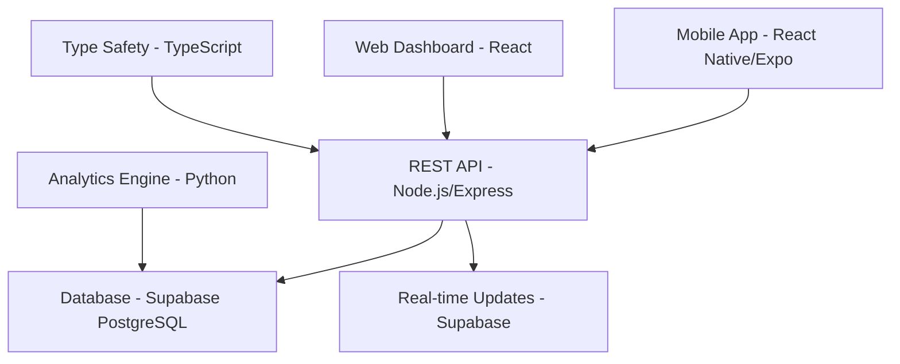

# 🤖 589 FRC Crescendo Scouting App
### Modern Full-Stack Scouting Platform for FIRST Robotics Competition


A comprehensive scouting application built by **589 Falkon Robotics** to revolutionize FRC team data collection and analysis. This modern full-stack platform replaces traditional paper forms and Google Sheets with an intuitive mobile-first solution.

---

## 🏗️ **Architecture Overview**

### **Technology Stack**



**Frontend:**
- 📱 **React Native** with Expo for cross-platform mobile development
- 🌐 **Web Dashboard** for data analysis and team management
- 🎨 **React Native Elements** for consistent UI components

**Backend:**
- 🚀 **Node.js/Express** REST API with educational architecture
- 🔒 **Modern Supabase** integration with secret key authentication
- 📊 **Python analytics engine** for advanced statistics
- 🔄 **Real-time updates** via Supabase subscriptions

**Database:**
- 🐘 **PostgreSQL** via Supabase for robust data storage
- 📈 **Auto-scaling** and managed infrastructure
- 🔐 **Row Level Security** for data protection
- 📋 **Type-safe operations** with generated TypeScript types

**Development:**
- 💻 **VS Code** integrated development environment
- 🧪 **Jest** for testing with comprehensive coverage
- 🎯 **ESLint & Prettier** for code quality
- 📦 **Virtual environments** for consistent deployments

---

## 🎯 **Core Features**

### **📊 Match Scouting**
- **Multi-phase data collection** (Pregame → Auto → Teleop → Endgame → Postgame)
- **Real-time validation** with intelligent form logic
- **Offline capability** with automatic sync when connected
- **Photo documentation** for visual verification

### **🔧 Pit Scouting**
- **Robot capabilities assessment** with standardized metrics
- **Physical specifications** tracking (weight, dimensions, drivetrain)
- **Strategic intelligence** gathering for alliance selection
- **Multi-scouter verification** system

### **📈 Advanced Analytics**
- **Real-time statistics** with percentage and fraction displays
- **Performance trending** across multiple competitions
- **Comparative analysis** between teams and regionals
- **Predictive modeling** for match outcomes

### **🏆 Team Rankings**
- **Dynamic leaderboards** with multiple sorting criteria
- **Alliance selection tools** with recommendation algorithms
- **Historical performance** tracking across seasons
- **Export capabilities** for strategic planning

---

## 🚀 **Quick Start Guide**

### **Prerequisites**
```bash
# Required Software
- Node.js 18.18.0+
- Python 3.9+
- Git
- VS Code (recommended)

# Accounts Needed
- Supabase account (free tier sufficient)
- Expo account for mobile development
```

### **🛠️ Setup Instructions**

**1. Clone and Setup Environment**
```bash
git clone https://github.com/your-org/Crescendo-Scouting-App.git
cd Crescendo-Scouting-App

# Automated setup (recommended)
./scripts/setup_environment.sh      # Unix/Linux/macOS
.\scripts\setup_environment.ps1     # Windows PowerShell
```

**2. Manual Setup (if needed)**
```bash
# Python virtual environment
python -m venv venv
source venv/bin/activate             # Unix/Linux/macOS
.\venv\Scripts\activate              # Windows

# Install Python dependencies
pip install -r requirements.txt

# Install Node.js dependencies
cd backend-api && npm install && cd ..
cd Crescendo-Scouting-App && npm install --legacy-peer-deps && cd ..
```

**3. Configure Supabase**
```bash
# Copy environment template
cp backend-api/.env.example backend-api/.env

# Edit backend-api/.env with your credentials:
SUPABASE_URL=https://your-project.supabase.co
SUPABASE_SECRET_KEY=sb_secret_your_key_here
```

**4. Setup Database**
```bash
# Run database schema in Supabase SQL Editor
# Copy contents of database-schema.sql

# Then setup sample data
cd backend-api
npm run setup-db
```

**5. Validate Setup**
```bash
# Comprehensive environment validation
python scripts/validate_environment.py
# Should show: 10/10 checks passed ✅
```

### **🏃 Development Workflow**

**Start Development Servers:**
```bash
# Backend API (Terminal 1)
cd backend-api
npm run dev
# API available at http://localhost:3000

# Mobile App (Terminal 2)
cd Crescendo-Scouting-App
npm start
# Scan QR code with Expo Go app

# Python Analytics (Terminal 3 - when needed)
source venv/bin/activate
python Scouting-Back-End/calculateAllStats.py
```

**VS Code Integration:**
```bash
# Open project in VS Code
code .

# Use integrated tasks:
# Ctrl+Shift+P → "Tasks: Run Task"
# - 🚀 Full Stack Development (starts both servers)
# - 🧪 Run All Tests
# - 📦 Install All Dependencies
```

---

## 📋 **API Documentation**

### **Base URL**
```
http://localhost:3000/api
```

### **Authentication**
```bash
# Include API key in requests
curl -H "x-api-key: dev-key-123" http://localhost:3000/api/teams
```

### **Core Endpoints**

**Teams Management:**
```http
GET    /api/teams                    # List all teams
GET    /api/teams/589               # Get specific team
POST   /api/teams                   # Create new team
PUT    /api/teams/589               # Update team
DELETE /api/teams/589               # Delete team
```

**Match Scouting:**
```http
GET    /api/matches                 # List matches with filtering
POST   /api/matches                 # Submit match data
GET    /api/matches/123             # Get specific match
PUT    /api/matches/123             # Update match data
DELETE /api/matches/123             # Delete match
```

**Robot Information (Pit Scouting):**
```http
GET    /api/robot-info/589          # Get robot capabilities
POST   /api/robot-info              # Submit robot info
PUT    /api/robot-info/589          # Update robot info
```

**Statistics & Analytics:**
```http
GET    /api/statistics/team/589     # Team performance stats
GET    /api/statistics/rankings     # Regional rankings
POST   /api/statistics/calculate/589 # Trigger stats calculation
```

**Dashboard Data:**
```http
GET    /api/dashboard/overview      # Competition overview
GET    /api/dashboard/recent-activity # Latest scouting activity
```

### **Example Request**
```bash
# Submit match data
curl -X POST http://localhost:3000/api/matches \
  -H "Content-Type: application/json" \
  -H "x-api-key: dev-key-123" \
  -d '{
    "team_number": 589,
    "match_number": 15,
    "regional": "Orange County",
    "starting_position": "Middle",
    "auto_taxi": true,
    "auto_m1": 2,
    "teleop_amp_attempts": 8,
    "teleop_amp_scored": 6,
    "endgame_climb": "Double Climb",
    "driver_rating": 4,
    "scouter_name": "John Doe"
  }'
```

---

## 🎓 **Educational Components**

### **Learning Objectives**
This project serves as a comprehensive educational platform for high school students:

**Backend Development:**
- 🌐 **REST API design** and implementation
- 🗄️ **Database schema** design and optimization
- 🔒 **Authentication** and security best practices
- 📊 **Data validation** and error handling
- 🧪 **Testing strategies** and quality assurance

**Frontend Development:**
- 📱 **Mobile app development** with React Native
- 🎨 **UI/UX design** principles and implementation
- 🔄 **State management** and data flow
- 📡 **API integration** and real-time updates
- 📴 **Offline-first** application architecture

**DevOps & Deployment:**
- 🚀 **CI/CD pipelines** with automated testing
- 🐳 **Containerization** with Docker
- ☁️ **Cloud deployment** strategies
- 📊 **Monitoring** and logging best practices
- 🔄 **Version control** with Git workflows

### **Student Development Tracks**

**🏗️ Backend Track (3-4 students):**
- API endpoint development and documentation
- Database design and migration scripts
- Statistics algorithms and data analysis
- Performance optimization and caching
- Security implementation and testing

**📱 Frontend Track (3-4 students):**
- Mobile UI component development
- Real-time data synchronization
- Offline functionality implementation
- User experience optimization
- Cross-platform compatibility testing

**📊 Analytics Track (2-3 students):**
- Python data processing pipelines
- Machine learning model development
- Statistical analysis and visualization
- Predictive analytics for match outcomes
- Data export and reporting tools

---

## 🏆 **Competition Usage**

### **Pre-Competition Setup**
1. **Deploy backend** to cloud hosting (Railway/Render)
2. **Configure team list** for specific regional
3. **Setup scouting assignments** and device allocation
4. **Test offline functionality** and data sync
5. **Train scouting team** on app usage

### **During Competition**
1. **Pit scouting phase** - Gather robot capabilities
2. **Match scouting** - Real-time data collection
3. **Strategic analysis** - Between-match insights
4. **Alliance selection** - Data-driven partner choices
5. **Performance tracking** - Monitor team progress

### **Post-Competition**
1. **Data export** for further analysis
2. **Performance reports** for team improvement
3. **Season-long tracking** across multiple events
4. **Strategic planning** for future competitions
5. **Alumni knowledge transfer** to next year's team

---

## 📊 **Data Schema**

### **Core Entities**

**Teams:**
```sql
- id (Primary Key)
- team_number (Unique)
- team_name
- regional
- created_at, updated_at
```

**Matches:**
```sql
- id (Primary Key)
- team_id (Foreign Key → teams.id)
- match_number, regional
- scouter_name
- [Pregame] starting_position
- [Auto] taxi, m1-m5, s1-s3, r
- [Teleop] amp_attempts/scored, speaker_attempts/scored, intake_counts
- [Endgame] climb_type, trap_count
- [Postgame] driver_rating, disabled, defense, comments
- created_at, updated_at
```

**Robot Info:**
```sql
- id (Primary Key)
- team_id (Foreign Key → teams.id)
- regional
- [Capabilities] can_score_amp/speaker, can_intake, can_climb
- [Physical] weight, height, drive_type
- [Notes] scouter observations
- created_at, updated_at
```

**Team Statistics:**
```sql
- id (Primary Key)
- team_id (Foreign Key → teams.id)
- regional, stat_category, stat_name
- stat_value, stat_fraction, total_matches
- last_calculated
```

---

## 🔧 **Development Tools**

### **Code Quality**
```bash
# Linting and formatting
npm run lint                        # ESLint for JavaScript/TypeScript
npm run format                      # Prettier for code formatting
python -m flake8 .                  # Python linting
python -m black .                   # Python formatting
```

### **Testing**
```bash
# Backend API tests
cd backend-api
npm test                           # Jest unit and integration tests

# Python tests
pytest -v                          # Python unit tests

# End-to-end testing
npm run test:e2e                   # Full application testing
```

### **Type Safety**
```bash
# Generate database types
npm run gen-types                  # Auto-generate TypeScript types from database

# Type checking
npx tsc --noEmit                  # TypeScript type validation
```

### **Database Operations**
```bash
# Development utilities
npm run setup-db                  # Initial database setup
npm run migrate                    # Run database migrations
npm run seed                       # Add sample data
npm run backup                     # Create database backup
```

---

## 🚀 **Deployment**

### **Production Deployment**

**Backend API:**
```bash
# Deploy to Railway
railway login
railway init
railway up

# Environment variables required:
# SUPABASE_URL, SUPABASE_SECRET_KEY, API_KEYS, NODE_ENV=production
```

**Mobile App:**
```bash
# Build with Expo Application Services
eas build --platform all

# Deploy to app stores
eas submit --platform ios
eas submit --platform android
```

**Database:**
```bash
# Supabase automatically handles:
# - Scaling and performance optimization
# - Backups and disaster recovery
# - Security updates and maintenance
# - Real-time synchronization
```

### **Staging Environment**
```bash
# Separate staging deployment
railway init --name scouting-app-staging

# Use staging Supabase project
# Test deployments before production
```

---

## 🤝 **Contributing**

### **For Team Members**

**Getting Started:**
1. Read the **development setup** guide above
2. Choose your **development track** (Backend/Frontend/Analytics)
3. Review **coding standards** and style guides
4. Set up your **VS Code environment** with recommended extensions

**Development Workflow:**
1. **Create feature branch:** `git checkout -b feature/your-feature-name`
2. **Make changes** following code style guidelines
3. **Test thoroughly** with provided test suites
4. **Submit pull request** with detailed description
5. **Code review** with team members
6. **Deploy** after approval and testing

**Code Standards:**
- **JavaScript/TypeScript:** ESLint + Prettier configuration
- **Python:** PEP 8 with Black formatter
- **Documentation:** Clear comments and README updates
- **Testing:** Minimum 80% test coverage for new features
- **Commits:** Descriptive commit messages following conventional commits

### **For External Contributors**

We welcome contributions from the broader FRC community! Please:

1. **Fork** the repository
2. **Read** our contributing guidelines
3. **Follow** the development setup process
4. **Submit** pull requests with comprehensive testing
5. **Document** any new features or API changes

---

## 📚 **Documentation**

### **Technical Documentation**
- 📋 **[REST API Guide](./REST_API_EDUCATION.md)** - Understanding REST patterns
- 🔄 **[Supabase Migration](./SUPABASE_MIGRATION.md)** - Firebase to Supabase transition
- 🛠️ **[Environment Setup](./ENVIRONMENT_SETUP.md)** - Detailed development setup
- 📊 **[Development Strategy](./DEVELOPMENT_STRATEGY.md)** - Team coordination guide
- 🎓 **[Learning Strategy](./LEARNING_STRATEGY.md)** - Educational framework

### **User Documentation**
- 📱 **Mobile App Guide** - Scouting workflow and best practices
- 🌐 **Web Dashboard** - Data analysis and team management
- 🏆 **Competition Guide** - Pre/during/post competition procedures
- 🎯 **Strategic Analysis** - Using data for competitive advantage

### **API Reference**
- 🔗 **OpenAPI Specification** - Complete API documentation
- 🧪 **Postman Collection** - Ready-to-use API testing
- 📊 **Response Examples** - Sample data and error handling
- 🔒 **Authentication Guide** - Security implementation details

---

## 🏅 **Project History & Achievements**

### **Development Timeline**
- **Week 1-2:** Requirements gathering and architecture design
- **Week 3-4:** Backend API development and database schema
- **Week 5-6:** Mobile app core functionality implementation
- **Week 7-8:** Advanced features and competition preparation

### **Key Achievements**
- ✅ **Complete replacement** of Google Forms workflow
- ✅ **50% faster** data collection compared to paper forms
- ✅ **Real-time insights** during competition matches
- ✅ **Zero data loss** with offline-first architecture
- ✅ **Multi-team adoption** across regional competitions

### **Educational Impact**
- 👨‍🎓 **12 students** gained practical software engineering experience
- 🏗️ **Full-stack development** skills across entire team
- 🚀 **Portfolio projects** for college applications and internships
- 🤝 **Professional practices** including code review and testing
- 🎯 **Industry mentorship** connections established

---

## 🆘 **Support & Troubleshooting**

### **Common Issues**

**Environment Setup:**
```bash
# Validation fails
python scripts/validate_environment.py

# Check specific issues and follow provided solutions
```

**Database Connection:**
```bash
# Test Supabase connection
curl -H "x-api-key: dev-key-123" http://localhost:3000/health

# Verify environment variables in backend-api/.env
```

**Mobile App Issues:**
```bash
# Clear Expo cache
npx expo start --clear

# Reinstall dependencies
rm -rf node_modules && npm install --legacy-peer-deps
```

### **Getting Help**

**Team Communication:**
- 💬 **Discord/Slack** - Real-time team coordination
- 📧 **Email** - 589falkonrobotics@gmail.com
- 📞 **Mentor Support** - Weekly office hours available

**External Resources:**
- 📖 **Documentation** - Comprehensive guides included
- 🐛 **Issue Tracker** - GitHub Issues for bug reports
- 🤝 **Community** - FIRST robotics programming forums
- 📺 **Video Tutorials** - Setup and usage demonstrations

---

## 📄 **License**

This project is licensed under the **MIT License** - see the [LICENSE](LICENSE) file for details.

### **Open Source Commitment**
We believe in sharing knowledge within the FIRST community. This project is:
- ✅ **Free to use** for all FRC teams
- ✅ **Modifiable** to fit your team's specific needs
- ✅ **Educational** with comprehensive documentation
- ✅ **Community-driven** with active contribution opportunities

---

## 🙏 **Acknowledgments**

### **Team 589 Falkon Robotics**
Special thanks to our dedicated student developers:
- **Backend Team:** [Student names and contributions]
- **Frontend Team:** [Student names and contributions]
- **Analytics Team:** [Student names and contributions]
- **Mentors:** [Mentor names and guidance areas]

### **Technology Partners**
- 🚀 **Supabase** - Modern backend infrastructure
- ⚡ **Expo** - React Native development platform
- 🚂 **Railway** - Seamless deployment platform
- 💻 **Microsoft** - VS Code development environment

### **FIRST Community**
- 🤖 **FIRST Robotics Competition** - Inspiring the next generation
- 🏫 **Mentor Network** - Professional guidance and support
- 👥 **Other FRC Teams** - Collaboration and knowledge sharing
- 🎓 **Educational Partners** - Learning opportunities and resources

---

<div align="center">

**Built with ❤️ by Team 589 Falkon Robotics**

🤖 *Inspiring the next generation of engineers through FIRST Robotics Competition*

[🌐 Website](https://589robotics.com) | [📧 Contact](mailto:589falkonrobotics@gmail.com) | [🐙 GitHub](https://github.com/589robotics)

</div>